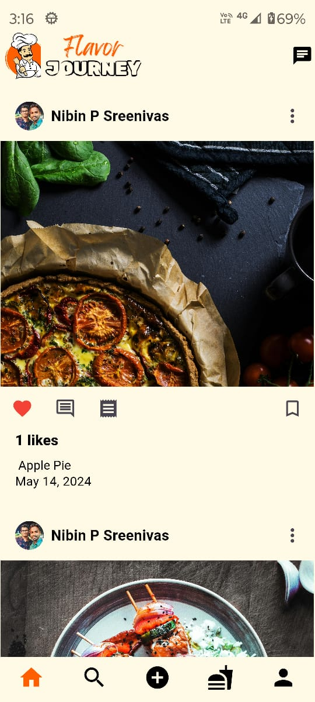
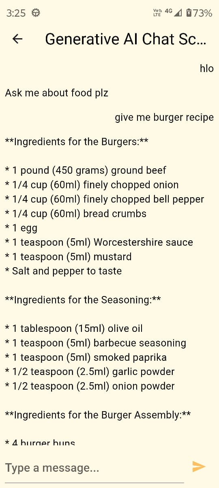
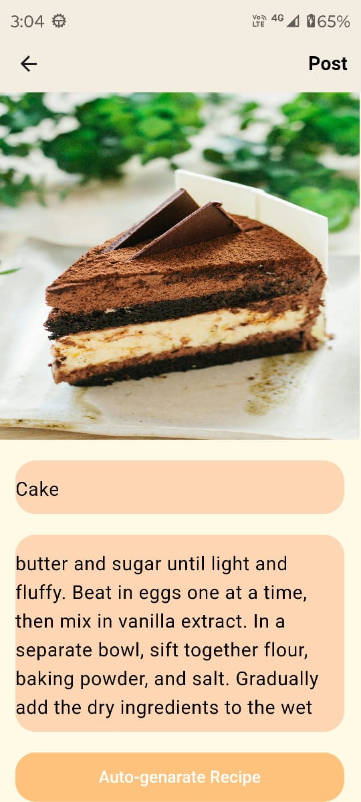
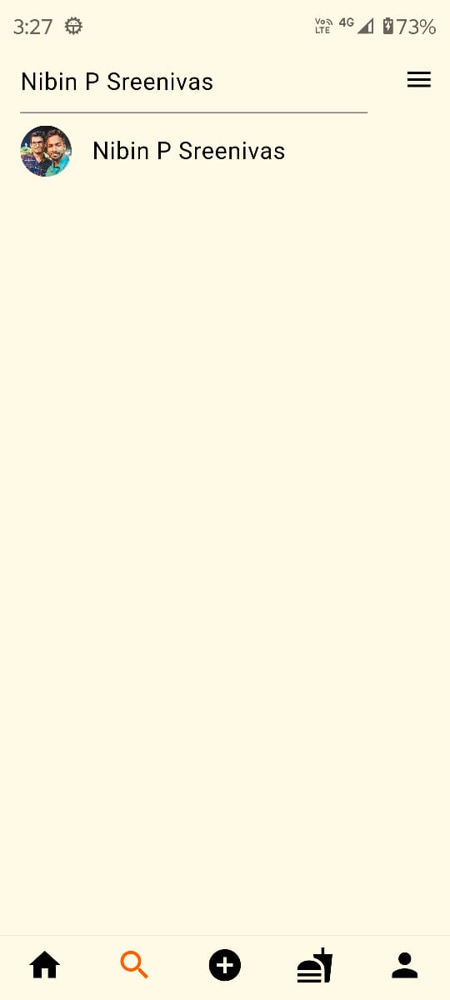
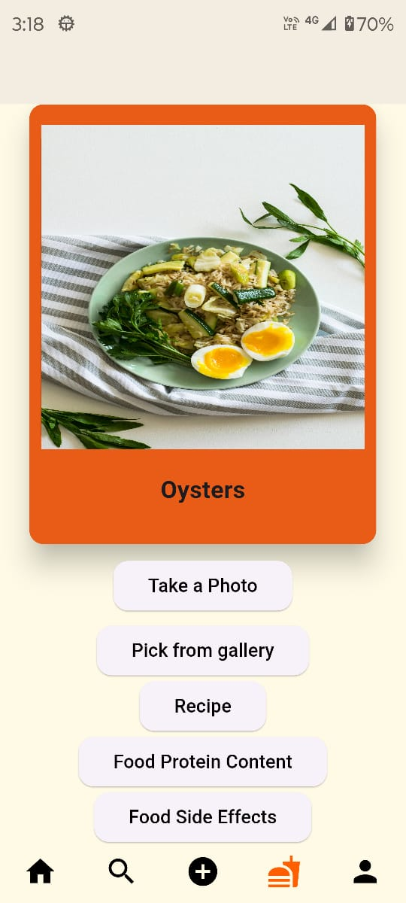
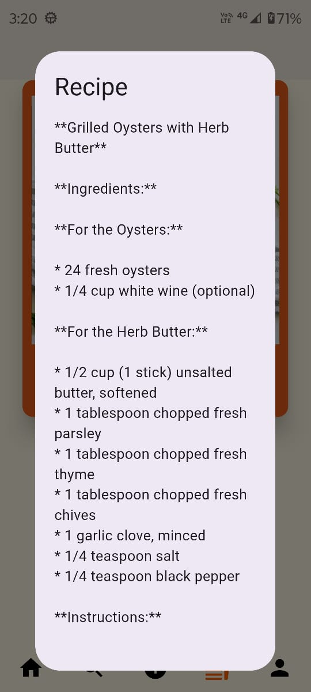
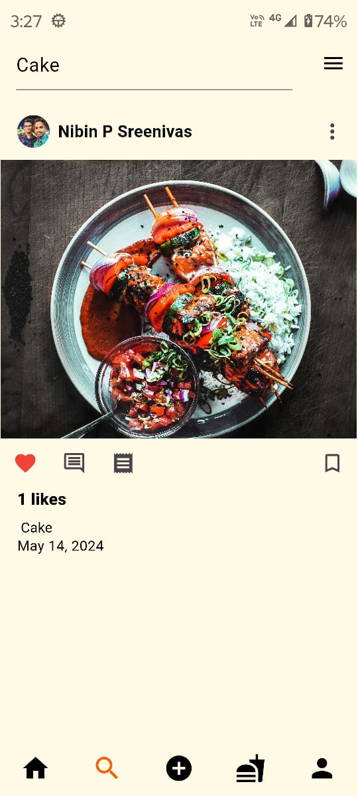

# FlavorJourney
 
 
FlavorJourney is a fully functional food recipe sharing social media app with multiple features built with flutter and dart.

Star⭐ the repo if you like what you see😉.
.gif)
## Screenshots

<table border>
    <tr>
        <th style="text-align:center">Home</th>
      <th style="text-align:center">Login</th>
        <th style="text-align:center">Register</th>
        <th style="text-align:center">Search</th>
    </tr>
    <tr>
        <td></td>
        <td></td>
          <td></td>
         <td></td>
    <tr>
</table>

<table border>
    <tr>
        <th style="text-align:center">Profile Page</th>
      <th style="text-align:center">Chat</th>
        <th style="text-align:center">POST</th>
        <th style="text-align:center">POST PREDICT</th>
    </tr>
    <tr>
        <td></td>
        <td></td>
          <td></td>
         <td></td>
    <tr>
</table>

<table border>
    <tr>
        <th style="text-align:center">NAME SEARCH</th>
      <th style="text-align:center">FOOD PREDICT</th>
        <th style="text-align:center">RECIPE</th>
        <th style="text-align:center">POST SEARCH</th>
    </tr>
    <tr>
        <td></td>
        <td></td>
          <td></td>
         <td></td>
    <tr>
</table>

 
## ✨ Requirements

* Any Operating System (ie. MacOS X, Linux, Windows)
* Any IDE with Flutter SDK installed (ie. IntelliJ, Android Studio, VSCode etc)
* A little knowledge of Dart and Flutter
* A brain to modify it
 
## Features
